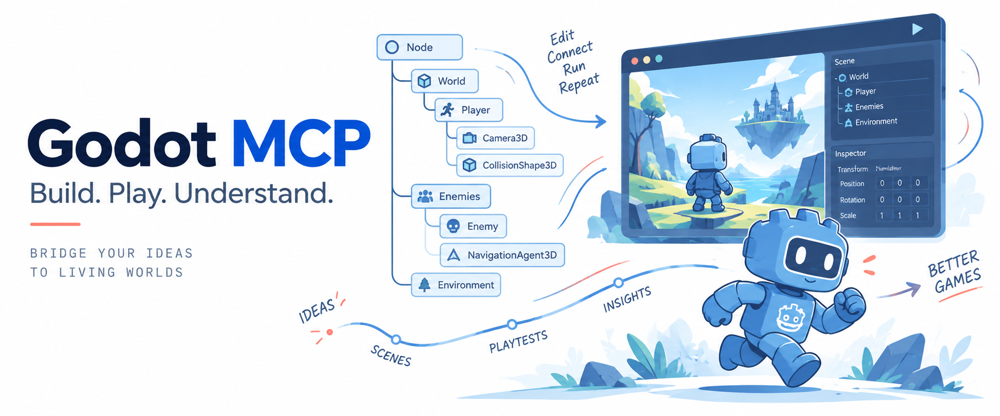

# godot-mcp

<p align="center">
  
</p>

<p align="center"><strong>Inspect, edit, run, and debug Godot projects through MCP.</strong><br>
Work with scenes, scripts, and a running game from your AI assistant.</p>

<p align="center">
  <a href="README.ko.md">한국어</a> · <a href="README.md">English</a>
</p>

<p align="center">
  <a href="https://github.com/smturtle2/godot-mcp/releases"></a>
  <a href="https://github.com/smturtle2/godot-mcp/releases"></a>
  <a href="https://www.python.org/downloads/release/python-3130/"></a>
  <a href="LICENSE"></a>
</p>

## Get started

Requires Godot **4.7.2** and an MCP client that supports local stdio servers. Linux x86_64 is tested; native testing on macOS, Windows, and Linux ARM64 is pending.

### Install the latest release

Linux/macOS:

```sh
curl -fsSL https://raw.githubusercontent.com/smturtle2/godot-mcp/main/install.sh | sh
```

Windows PowerShell:

```powershell
irm https://raw.githubusercontent.com/smturtle2/godot-mcp/main/install.ps1 | iex
```

The public installer fetches the latest stable release and installs it in the default user directory without asking questions. It does not detect or ask for a Godot executable or engine version. It installs a user-local stable `godot-mcp` command and adds its directory to your user shell `PATH`; open a new terminal before using that command.

The installer prints a fixed absolute stdio command for MCP client setup. GUI MCP clients should use that printed command because their `PATH` may differ from your shell. The client launches the server; the installer does not write client configuration.

### Install a project plugin with your AI

Register the printed stdio command with your MCP client, then ask your AI assistant to install the plugin for an absolute project directory. The `install_plugin` setup tool uses the server’s configured installation home and the same transactional installer as the CLI. It works before Godot is open.

Close the project in Godot before installing its plugin. Installation enables the plugin automatically; then open the project in Godot. Then ask your AI:

> Check the connected Godot project and describe the current scene.

If several projects are open, provide the assistant with the absolute project path to select.

### CLI alternative

```bash
godot-mcp init /path/to/project
```

With no project argument, `godot-mcp init` uses the current folder. Check a running editor with:

```bash
godot-mcp check --project /path/to/project
```

The command and MCP executable path stay the same after updates. Close linked Godot projects before re-running the installer, then reconnect MCP to start the new server.

See [setup and troubleshooting](docs/installation.md) for linking, discovery, updates, and rollback.

## Tools

There are **43 tools**: 42 editor/runtime tools plus the `install_plugin` setup tool. They cover scenes, scripts, resources, animation, TileMaps, game input, debugging, and exports. Changes can be inspected before saving; runtime tools report observations from the running game.

Browse the [tool reference](docs/tools.md) for all tool descriptions and input schemas.

## Development

See [development](docs/development.md) for setup, tests, and releases, or [architecture](docs/architecture.md) for the server and Godot plugin design.

## License

[EUPL-1.2](LICENSE).
